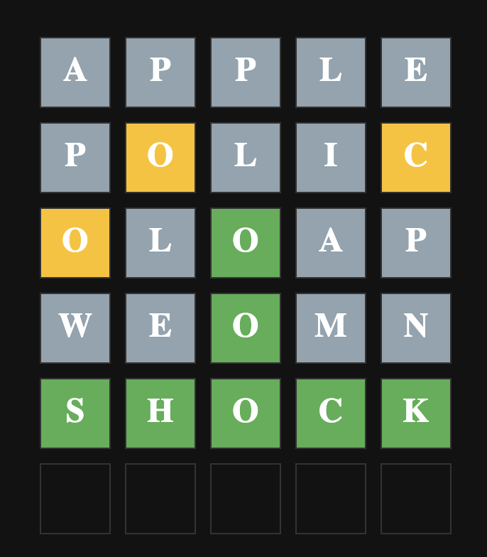

# Wordle — my implementation

❗ Work in progress: Project under development

This is my implementation of the Wordle game.

Server responsibility

The server is solely responsible for selecting and holding the secret word for each game. The client never has access to the secret word, which prevents potential cheating. Game state (secret word, attempts, progress) is stored on the server side in the HTTP session, so each browser session has an independent game.

## Technology

- Frontend: `React`, `TypeScript`, `Vite`, `Sass (SCSS)`, `@tanstack/react-query`, `Axios`
- Backend: `Java`, `Spring Boot`, `Maven`, `HTTP session` (server-side game state), `words.json` (server-side word list)

## Endpoints

Base URL: `http://localhost:8080`

- `POST /api/wordle-game/start` — Start a new game; the server picks a secret word and stores it in the HTTP session for the current client.
- `POST /api/wordle-game/guess` — Submit a guess for the current session's game. Request body example: `{ "guess": "apple" }`. Returns per-letter feedback and updated game state.

The server is authoritative for game rules and validation; the client only renders state returned by these endpoints.

